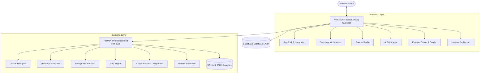

# Qubit.lab — Quantum Algorithm & Education Platform

A full-stack quantum computing education and algorithm development platform featuring multi-backend simulation, interactive curriculum workflows, automated problem grading, and context-aware circuit analysis.

---

## Overview

Qubit.lab combines theoretical quantum mechanics with live circuit execution. Designed for students, educators, and developers, the platform integrates:

- A drag-and-drop circuit simulator supporting execution across Qiskit Aer, PennyLane, and Cirq.
- Interactive textbook courses with inline simulation sandboxes and step-by-step mathematical derivations.
- An integrated AI assistant for real-time circuit diagnostics, anomaly detection, and Socratic guidance.
- A problem bank with automated statevector and unitary matrix verification.
- A learner dashboard tracking concept mastery, execution history, and daily challenge evaluations.

---

## Core Modules

### 1. Quantum Simulator Workbench
- **Circuit Grid**: Drag-and-drop support for single-qubit ($H, X, Y, Z, S, T, R_x, R_y, R_z$), two-qubit ($CX, CY, CZ, SWAP, CH$), and three-qubit ($CCX$ Toffoli, $CSWAP$ Fredkin) operations.
- **Multi-Backend Simulation Engine**: Native integration with Qiskit Aer, PennyLane (`default.qubit`), and Cirq, with automated cross-backend equivalence checks ($\Delta P \le 10^{-4}$, Fidelity $\ge 0.999$).
- **State Visualizations**:
  - 3D Q-Sphere rendering for entangled quantum states.
  - Single-qubit Bloch sphere vectors showing Pauli expectation values $\langle X \rangle, \langle Y \rangle, \langle Z \rangle$ and purity $r$.
  - Statevector breakdown into probability amplitudes and Dirac LaTeX representation.
- **Code Export & Synchronization**: Real-time bi-directional conversion between visual Circuit IR, Qiskit (Python), OpenQASM 3.0, Cirq, PennyLane, and Quirk URL formats.

### 2. AI Quantum Assistant & Socratic Tutor
- **Real-Time Circuit Inspection**: Reads active canvas state directly from the editor.
- **Diagnostic Engine**: Identifies unconnected qubits, index boundary errors, and redundant self-canceling gate pairs.
- **Socratic Guidance**: Explains underlying quantum mechanics and resolves common misconceptions (such as no-cloning violations and phase distinctions).
- **Step-by-Step Evolution**: Column-by-column statevector transformation analysis.

### 3. Interactive Curriculum (Course 01: From Bit to H Gate)
- **13 Modular Lessons**:
  - Module 01: What is Quantum Computing?
  - Module 02: Classical Bits & Multi-Bit Combinations
  - Module 03: From Bit to Qubit ($|\psi\rangle = \alpha|0\rangle + \beta|1\rangle$)
  - Module 04: Physical Qubit Implementations
  - Module 05: State Normalization ($|\alpha|^2 + |\beta|^2 = 1$)
  - Module 06: Measurement & Wavefunction Collapse
  - Module 07: Superposition & The $|+\rangle$ / $|-\rangle$ States
  - Module 08: Quantum Gates & Unitary Reversibility ($U^\dagger U = I$)
  - Module 09: The Hadamard Matrix ($H$)
  - Module 10: Live H Gate Experimentation & Shot Statistics
  - Module 11: The Self-Inverse Property ($H^2 = I$)
  - Module 12: Circuit Lab with 3 Guided Missions
  - Module 13: Socratic Synthesis & Evaluation
- **Progress Tracking**: Automatic synchronization with user profiles and backend analytics.

### 4. Problem Bank & Verification Engine
- **32 Algorithmic Problems**: Standard problem sets covering basic state preparation, Bell states, GHZ states, Deutsch-Jozsa, Bernstein-Vazirani, and Grover's search.
- **Automated Grading**: Compares user circuits against reference target statevectors with numerical tolerance.
- **Tiered Hints**: Progressive clue disclosure without revealing complete solutions.

### 5. Analytics & Daily Challenges
- **Learner Dashboard**: Real-time tracking of simulation counts, completed courses, and concept mastery distributions.
- **Daily Challenges**: Auto-generated MCQ and theoretical reasoning questions with structured rubric grading.

---

## System Architecture



---

## Directory Structure

```
.
├── backend/                        # FastAPI Simulation & AI Backend
│   ├── algorithms.py               # Reference quantum algorithm implementations
│   ├── analytics.py                # Analytics event logger & metrics calculator
│   ├── chat_store.py               # SQLite chat history manager
│   ├── code_runner.py              # Python code generator & execution sandbox
│   ├── comparator.py               # Cross-backend equivalence verification
│   ├── converter.py                # IR to Qiskit / Cirq / PennyLane / OpenQASM
│   ├── engine.py                   # Multi-engine simulation runner
│   ├── gemini_service.py           # Google Gemini AI integration
│   ├── main.py                     # FastAPI routes and API entrypoint
│   ├── problems.py                 # Problem registry & verification logic
│   ├── quirk_importer.py           # Quirk JSON & URL importer
│   ├── recent_simulation.py        # Recent circuit execution state manager
│   ├── schemas.py                  # Pydantic v2 data models
│   ├── state_analyzer.py           # Bloch vectors, Pauli expectations, Dirac LaTeX
│   ├── tutor.py                    # Deterministic circuit diagnostic rules
│   ├── requirements.txt            # Python dependencies
│   └── tests/                      # Pytest test suites (78 tests)
│
├── quantum-algorithm-platform/     # Next.js 16 Frontend
│   ├── app/                        # App Router pages (/home, /learn, /simulator, etc.)
│   ├── components/                 # React UI components
│   │   ├── auth/                   # Authentication components
│   │   ├── course/                 # CourseZeroInteractive (13-module studio)
│   │   ├── dashboard/              # Dashboard cards and charts
│   │   ├── layout/                 # AppShell, Sidebar, Topbar
│   │   ├── learning/               # Course views and interactive workspaces
│   │   ├── problems/               # Problem list, detail, and solver views
│   │   ├── simulator/              # Simulator workbench, Q-Sphere, CodePanel
│   │   └── tutor/                  # AI Tutor chat interface
│   ├── context/                    # React authentication context
│   ├── hooks/                      # Custom React hooks (useCourses)
│   ├── lib/                        # Supabase client and code utilities
│   ├── services/                   # Curriculum service with offline fallback
│   ├── types/                      # TypeScript type definitions
│   └── utils/                      # OpenQASM parser and utilities
│
├── COURSE_01_CURRICULUM_DETAILS.md # Curriculum blueprint specification
├── .env.example                    # Backend environment template
├── .gitignore                      # Git ignore configuration
└── README.md                       # Documentation
```

---

## Setup and Installation

### Prerequisites
- Node.js 20+ or 22+
- Python 3.11 or 3.12
- `uv` (recommended) or `pip`

---

### 1. Backend Setup

```bash
# Navigate to project root
cd sih1

# Create and activate virtual environment
uv venv backend/.venv --python 3.12
source backend/.venv/bin/activate

# Install dependencies
uv pip install -r backend/requirements.txt

# Copy environment configuration
cp .env.example .env

# Start FastAPI server on port 8008
PYTHONPATH=. backend/.venv/bin/uvicorn backend.main:app --host 127.0.0.1 --port 8008 --reload
```

Interactive API documentation is available at `http://localhost:8008/docs`.

---

### 2. Frontend Setup

```bash
# Navigate to frontend directory
cd sih1/quantum-algorithm-platform

# Install dependencies
npm install

# Copy frontend environment configuration
cp .env.local.example .env.local

# Start Next.js development server on port 3000
npm run dev -- --port 3000
```

The web application is accessible at `http://localhost:3000`.

---

## Testing

### Backend Unit & Integration Tests
```bash
cd sih1
PYTHONPATH=. backend/.venv/bin/pytest backend/tests/ -v
```

### Frontend Typecheck & Production Build
```bash
cd sih1/quantum-algorithm-platform
npx tsc --noEmit
npm run build
```

---

## API Summary

| Method | Endpoint | Description |
| :--- | :--- | :--- |
| `GET` | `/health` | Health status and available simulation backends |
| `POST` | `/execute` | Run quantum circuit via Qiskit Aer (counts, statevector) |
| `POST` | `/execute/compare` | Cross-backend execution comparison (Qiskit vs PennyLane vs Cirq) |
| `POST` | `/state/bloch` | Compute Bloch vectors and Pauli expectation values |
| `POST` | `/state/dirac` | Convert statevector to Dirac LaTeX representation |
| `POST` | `/tutor/chat` | Socratic AI Tutor conversational chat |
| `POST` | `/tutor/analyze-circuit` | Circuit anomaly detection and diagnostics |
| `GET` | `/api/problems` | List all problem bank entries |
| `POST` | `/api/problems/check` | Verify user circuit against reference algorithm |
| `GET` | `/api/daily-challenge/today` | Fetch current daily challenge |
| `POST` | `/api/daily-challenge/evaluate` | Automated evaluation for theoretical challenge answers |
| `GET` | `/api/simulation/latest` | Retrieve most recent simulation result |
| `GET` | `/dashboard/metrics` | Retrieve aggregated dashboard metrics |

---

## Security

- All local environment configuration files (`.env`, `.env.local`) are strictly excluded from version control via `.gitignore`.
- If external credentials (such as Supabase or Gemini API keys) are not provided, the platform automatically uses local simulation and deterministic diagnostic engines without service interruption.

---

## License

This project is licensed under the MIT License.
