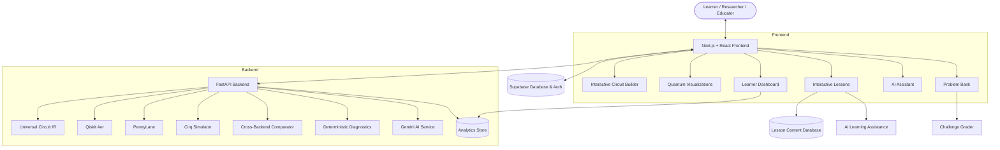

# Smart India Hackathon 2026

## AI-Based Interactive Quantum Algorithm Learning Platform

**Problem Statement ID:** SIH26140  
**Problem Statement Title:** AI-based Interactive Quantum Algorithm Learning Platform  
**Theme:** Smart Education  
**Category:** Software  
**Team Name:** Introvates  

---

## 1. Executive Summary & Core Motivation

### Why Afraid of Quantum?

Quantum computing is widely perceived as intimidating, esoteric, and inaccessible. Our research into how quantum computing and quantum algorithms are currently taught across premier Indian institutions (**IITs, IISERs, IISc, and NPTEL**) revealed three critical systemic bottlenecks:

1. **Abstract Mathematical Barriers**: Superposition, phase kickback, quantum interference, and multipartite entanglement are difficult to internalize through static 2D circuit diagrams and chalkboard linear algebra alone.
2. **Static, Theory-Heavy Resources**: Students are exposed to heavy theoretical notes without instant visual feedback or the ability to inspect state transformations in real time.
3. **Fragmented Tooling Ecosystem**: Existing tools are disconnected students toggle between static PDFs, raw command-line Python scripts, Quirk web sandboxes, and IBM Quantum Composer.

**Our Mission**: To make abstract quantum computing tangible, practical, and accessible in one unified platform.

---

## Setup and Installation

### Prerequisites
- Node.js 20+ or 22+
- Python 3.11 or 3.12
- `uv` (recommended) or `pip`

---

### 1. Backend Setup

```bash
# Navigate to project root
cd sih1

# Create and activate virtual environment
uv venv backend/.venv --python 3.12
source backend/.venv/bin/activate

# Install dependencies
uv pip install -r backend/requirements.txt

# Copy environment configuration
cp .env.example .env

# Start FastAPI server on port 8008
PYTHONPATH=. backend/.venv/bin/uvicorn backend.main:app --host 127.0.0.1 --port 8008 --reload
```

Interactive API documentation is available at `http://localhost:8008/docs`.

---

### 2. Frontend Setup

```bash
# Navigate to frontend directory
cd sih1/quantum-algorithm-platform

# Install dependencies
npm install

# Copy frontend environment configuration
cp .env.local.example .env.local

# Start Next.js development server on port 3000
npm run dev -- --port 3000
```

The web application is accessible at `http://localhost:3000`.

---

## 2. Proposed Solution

**Qubit.lab** by **Team Introvates** is an AI-powered, browser-based quantum computing workspace that unifies conceptual learning, circuit design, multi-engine simulation, automated code translation, interactive lessons, and real-time AI assistance.

### Key Pillars of the Solution

- **Dual-Design Circuit Builder**: Visual drag-and-drop circuit canvas seamlessly synchronized with real-time code generation across Qiskit, OpenQASM 3.0, Cirq, and PennyLane.
- **Multi-Backend Simulation Suite**: Real-time statevector and shot-based simulation via Qiskit Aer, PennyLane (`default.qubit`), and Cirq with automated cross-backend validation.
- **Rich Quantum Visualization**: Multi-qubit 3D Q-Sphere, single-qubit Bloch vector analyzers ($\langle X \rangle, \langle Y \rangle, \langle Z \rangle$), probability histograms, and Dirac LaTeX state decomposition.
- **Structured Interactive Lessons**: Embedded inline quizzes, circuit challenges, and real-time AI responses directly within learning modules.
- **Context-Aware Socratic AI Tutor**: An AI assistant that can reason about the active learning context and provide targeted explanations around quantum concepts, circuits, and problems.
- **Algorithmic Problem Bank & Quest Grader**: Curated coding and circuit-building problems with automated unitary and statevector equivalence testing.
- **Learner Dashboard & Analytics**: Dynamic concept mastery tracking, streak tracking, XP awards, and learning progress visualization.
- **Community Commons**: Dedicated platform for blogs, open research discussions, and circuit sharing.

---

## 3. Innovation & Uniqueness

### 1. Cross-Simulator Verification

Qubit.lab can execute circuits across multiple quantum simulation engines and compare their outputs to validate circuit behavior.

The platform combines deterministic numerical simulation with cross-backend comparison to identify discrepancies and provide confidence in the resulting circuit behavior.

### 2. Context-Aware Workspace AI

Unlike a generic chatbot, the AI layer is designed to operate alongside the learner's quantum workspace.

The assistant can use learning context such as:

- Active lesson
- Current problem
- Circuit structure
- Quantum gates
- Generated code
- Simulation results
- Quiz responses

This allows explanations to be connected directly to what the learner is currently doing rather than providing isolated textbook-style answers.

### 3. Interactive Learning Instead of Static Theory

Quantum concepts are presented through a combination of:

**Theory → Visualization → Interaction → Circuit Experiment → Quiz → Feedback**

Students can immediately experiment with the concept being taught and observe how changes to a quantum circuit affect its resulting state.

### 4. Planned Personalized Learner Profiling

A future adaptive-learning layer will continuously map individual learner strengths, weaknesses, learning preferences, and growth areas.

This profile will be used to dynamically tailor:

- Explanation style
- Lesson depth
- Examples
- Practice questions
- Circuit challenges
- Revision content
- Future lesson difficulty

This personalization layer is part of the planned roadmap and is not yet fully implemented.

---

## 4. Current Implementation Status

Our repository contains a working web platform prototype with a Next.js frontend and FastAPI Python backend.

### A. Frontend Layer (`quantum-algorithm-platform/`)

- **App Router Shell**: Clean multi-view workspace supporting `/home`, `/learn`, `/problems`, `/simulator`, `/tutor`, `/dashboard`, `/community`, `/settings`, and `/auth`.
- **Drag-and-Drop Circuit Canvas**: Supports single-qubit ($H, X, Y, Z, S, T, R_x, R_y, R_z$), two-qubit ($CX, CY, CZ, SWAP, CH$), and three-qubit ($CCX$ Toffoli, $CSWAP$ Fredkin) gates with interactive parameter controls.
- **CodePanel**: Real-time circuit-to-code translation across Qiskit, OpenQASM 3.0, Cirq, PennyLane, and Quirk formats.
- **Visualization Suite**:
  - Interactive 3D Q-Sphere displaying multi-qubit superposition amplitudes and phase information.
  - Real-time Bloch Sphere visualization for single-qubit states.
  - Dirac LaTeX state decomposition.
  - Probability distributions from circuit simulation.
- **Interactive Lesson Studio**: Interactive quantum-learning modules combining explanatory theory, mathematical representations, visual explanations, quizzes, circuit interactions, and simulator-based experimentation. The current implementation contains a limited set of foundational lessons that demonstrate the planned learning experience.
- **Challenge Solver & Grader**: Interactive problem bank with circuit-building challenges, progressive hints, and solution verification.
- **Daily AI Challenge Card**: Daily MCQ and theoretical reasoning challenges with automated rubric evaluation.
- **Learner Progress UI**: XP, streak, level, course progress, and concept-oriented learning progress.

### B. Backend Layer (`backend/`)

- **FastAPI Engine**: REST API with CORS and structured Pydantic schemas.
- **Bi-Directional Circuit IR**: Universal JSON representation mapping circuits across supported quantum frameworks.
- **Multi-Engine Execution**: Qiskit Aer statevector and shot simulation, PennyLane engine, and Cirq runner.
- **Cross-Backend Comparator**: Numerical state comparison for validating execution results across engines.
- **Deterministic Diagnostic Engine**: Rule-based quantum circuit analysis for detecting issues such as unmeasured qubits, index errors, and redundant operations.
- **Google Gemini AI Service**: AI-powered Socratic tutoring and quantum-learning assistance.
- **Analytics Store**: Persistent SQLite and JSON stores tracking user progress, simulations, and concept mastery.

---

## 5. Interactive Lesson Pipeline

The current platform contains a small number of implemented lessons to demonstrate the learning experience. The long-term vision is to expand this into a structured, adaptive quantum-learning pipeline.

### Planned Lesson Pipeline

```text
Quantum Concept
      ↓
Core Theory
      ↓
Visual Explanation
      ↓
Interactive Example
      ↓
"Try It Yourself" Activity
      ↓
Inline Quiz
      ↓
Circuit Challenge
      ↓
Simulation / Visualization
      ↓
AI Feedback
      ↓
Concept Mastery Update
      ↓
Next Recommended Lesson
```

Each lesson is designed to move beyond passive reading.

For example:

```text
Superposition
      ↓
Learn the concept
      ↓
Visualize |ψ⟩ = α|0⟩ + β|1⟩
      ↓
Modify amplitudes interactively
      ↓
Build H|0⟩
      ↓
Run simulation
      ↓
Answer a short quiz
      ↓
Receive feedback
      ↓
Practice with a circuit challenge
```

### Current State of Lessons

Only a limited number of foundational lessons are currently implemented as a working demonstration.

### Planned Expansion

Lesson content will be sourced and curated from:

- Official quantum-computing documentation and educational resources
- Open quantum-computing textbooks and course materials
- University and NPTEL quantum-computing curricula
- Open educational resources such as qBraid qBook and similar platforms
- Peer-reviewed and academically verified resources for advanced concepts

These resources will be **curated and structured by the platform**, rather than simply displaying the original material. Each topic can be transformed into an interactive learning flow containing theory, visual explanations, examples, quizzes, circuit activities, simulations, and AI-assisted feedback.

The lesson database will be designed as a modular content layer, allowing new concepts and lessons to be added progressively without changing the core application.

In the future, the AI and learner-profile systems will use this growing lesson database to recommend relevant content, generate supplementary explanations, and create targeted practice based on individual learner progress.

### Problem Library

Problems will be expanded alongside the lesson library to provide learners with practical opportunities to apply the concepts they have learned.

Problems will be sourced and curated from:

- Official quantum-computing educational resources
- University and NPTEL curricula
- Open quantum-computing textbooks and course materials
- Curated circuit-building and quantum programming exercises
- Peer-reviewed and academically verified resources

Problems will be organized by **concept, difficulty, prerequisites, and learning objective**, allowing learners to progressively move from basic concept checks to more complex circuit-building and quantum-algorithm challenges.

The problem system will provide automated solution verification, while AI assistance can be used where appropriate for **hints, explanations, and guidance when a learner is stuck**.

As the problem library grows, it can also support educators by providing structured assessments that help evaluate student understanding and difficulty levels. In future versions, teachers can assign problems to students and use performance data to identify concepts where individual students or groups may need additional support.

Over time, problem performance can also contribute to the planned learner-profile system, helping the platform recommend suitable practice and learning content for each learner.
---

## 6. AI-Powered Learning & Personalization Roadmap

### Current AI Capabilities

The current platform demonstrates AI-assisted quantum learning through Gemini-powered assistance.

The AI can provide:

- Concept explanations
- Socratic guidance
- Problem-solving assistance
- Circuit-related explanations
- Learning-context-aware responses
- Follow-up questions

### Context-Aware Assistance — Planned Enhancement

A future version will detect when a learner is struggling with a circuit or quiz and proactively provide targeted assistance.

For example:

```text
Student attempts circuit
        ↓
Circuit / Quiz Analysis
        ↓
Detect repeated mistake
        ↓
Identify likely concept gap
        ↓
AI generates alternative explanation
        ↓
Short follow-up check
        ↓
Re-evaluate understanding
```

Instead of simply saying:

> "Your answer is incorrect."

the system could respond with:

> "It looks like the difference between a bit flip and a phase flip may be causing the issue. Let's look at what the X gate actually changes."

It could then generate a small follow-up question or circuit experiment to verify whether the concept has been understood.

**This proactive struggle-detection and adaptive assistance layer is planned and is not yet fully implemented.**

### Personalized Learner Profiling — Planned

The long-term platform will maintain a learner profile representing conceptual mastery and learning behavior.

The profile can eventually include:

```text
Learner Profile
│
├── Concept Mastery
│   ├── Qubits       → 92%
│   ├── Superposition → 78%
│   ├── Gates         → 85%
│   └── Entanglement  → 54%
│
├── Strengths
│   ├── Visual reasoning
│   └── Circuit experimentation
│
├── Growth Areas
│   ├── Mathematical notation
│   └── Measurement
│
├── Learning Signals
│   ├── Quiz mistakes
│   ├── Attempts
│   ├── Hint usage
│   └── Time spent
│
└── Recommended Next Steps
```

The system will use this information to personalize future lessons and practice.

**Personalized learner profiling and dynamic lesson adaptation are planned roadmap features and are not yet fully implemented.**

---

## 7. Technical Approach & Architecture

### Technology Stack

- **Languages**: Python 3.12, TypeScript
- **Backend Framework**: FastAPI, Uvicorn, Pydantic v2
- **Database & Auth**: Supabase (PostgreSQL + JWT Auth) with offline localStorage resilience
- **Quantum SDKs**: Qiskit + Qiskit Aer, PennyLane, Cirq, qBraid-SDK, Qsim
- **Frontend Framework**: Next.js, React, Tailwind CSS
- **Visualization**: Recharts, KaTeX, interactive 3D quantum visualizations
- **AI / LLM**: Google Gemini API
- **Testing**: Pytest, TypeScript strict mode
- **Deployment**: Docker, Vercel, Railway / Cloud Containers

### System Architecture



---

## 10. Future Scope & Implementation Plan

### 1. Adaptive Lesson Pipeline

Expand the current limited set of interactive lessons into a complete quantum-learning curriculum.

The pipeline will combine:

- Theory
- Interactive visualizations
- Inline quizzes
- Circuit experiments
- Circuit challenges
- Simulation
- AI feedback
- Mastery tracking

The long-term system will recommend what a learner should study next based on their progress.

### 2. Context-Aware AI Assistance

Develop the AI tutor into a proactive learning assistant capable of detecting repeated mistakes and signs of conceptual difficulty.

The system will:

- Analyze quiz responses
- Inspect circuit construction
- Identify likely misconceptions
- Generate alternative explanations
- Create targeted follow-up questions
- Recommend additional practice

### 3. Personalized Learner Profiling

Build a persistent learner model that tracks:

- Concept mastery
- Quiz performance
- Circuit attempts
- Common mistakes
- Hint usage
- Learning progress
- Strengths and growth areas

This profile will eventually drive dynamic lesson and problem recommendations.

### 4. RAG-Powered Quantum Knowledge Base

Enhance the Gemini AI Tutor with Retrieval-Augmented Generation over trusted quantum-learning resources.

Potential sources include:

- Quantum computing textbooks
- Official quantum SDK documentation
- Open educational resources
- Peer-reviewed literature
- Verified course materials

The objective is to ground AI explanations in reliable quantum-computing knowledge.

### 5. Teacher Dashboard & Student Tracking

Future versions will include a dedicated teacher dashboard that allows educators to manage and track their students' learning progress.

Teachers will be able to:

- Create and manage classes or student groups
- Add or invite individual students
- Assign lessons, quizzes, and problems
- Track individual student progress
- Monitor concept-wise mastery
- View problem-solving performance and completion
- Identify students struggling with specific concepts
- Review learning activity and assessment performance
- Compare progress across students or groups
- Create targeted assignments based on student performance

Teachers will be able to open an individual student's profile to understand their learning journey, including completed lessons, problems solved, concept mastery, quiz performance, and areas that require additional attention.

For example:

```text
Student A

Overall Progress       72%
Problems Solved        34
Concept Mastery        68%

Strong Areas:
✓ Qubits
✓ Quantum Gates

Needs Attention:
⚠ Measurement
⚠ Entanglement

Recent Activity:
• Completed Superposition lesson
• Attempted Measurement quiz
• Struggled with Entanglement challenge
• Used hint during circuit problem
```

This will allow educators to move beyond simply assigning content and gain visibility into **how individual students are learning, where they are struggling, and which concepts require additional support**.

The teacher dashboard will eventually integrate with the learner-profile and analytics systems so that student performance can be used to create targeted assignments and support personalized learning recommendations.

### 6. Collaborative Quantum Commons & Educator Portal

Future versions can introduce:

- Multiplayer circuit editing
- Shared circuits
- Classroom assignments
- Educator dashboards
- Student cohort mastery analytics
- Community research discussions
- Circuit and lesson sharing

---

## 11. Research and References

- **Quantum Documentation & Curriculum Reference**: [qBraid qBook](https://qbook.qbraid.com/)
- **Quantum Circuit Interface Reference**: [Quirk Quantum Circuit Simulator](https://algassert.com/quirk)
- **Quantum Frameworks**: [Qiskit](https://github.com/Qiskit) and [IBM Quantum Composer](https://quantum.cloud.ibm.com/composer)
- **Algorithmic Foundations**: [Wikipedia — Quantum Algorithms](https://en.wikipedia.org/wiki/Quantum_algorithm)
- **Pedagogical Research**: Analysis of quantum computing curricula across Indian institutes (**IITs, IISERs, IISc, NPTEL**) demonstrating the need for interactive visual feedback alongside theoretical instruction.

---

## 12. Verification & Quality Assurance

- **Backend Testing**: Pytest suite covering quantum simulation, circuit processing, API behavior, and core backend functionality.
- **Frontend Type Safety**: TypeScript strict validation.
- **Production Build**: Next.js production build across application routes.
- **Security & Privacy**: API keys and secrets isolated through environment configuration and excluded from source control.
- **Deterministic Simulation**: Quantum state and probability calculations are performed through established quantum simulation engines rather than generated by AI.

---


---

## Directory Structure

```
.
├── backend/                        # FastAPI Simulation & AI Backend
│   ├── algorithms.py               # Reference quantum algorithm implementations
│   ├── analytics.py                # Analytics event logger & metrics calculator
│   ├── chat_store.py               # SQLite chat history manager
│   ├── code_runner.py              # Python code generator & execution sandbox
│   ├── comparator.py               # Cross-backend equivalence verification
│   ├── converter.py                # IR to Qiskit / Cirq / PennyLane / OpenQASM
│   ├── engine.py                   # Multi-engine simulation runner
│   ├── gemini_service.py           # Google Gemini AI integration
│   ├── main.py                     # FastAPI routes and API entrypoint
│   ├── problems.py                 # Problem registry & verification logic
│   ├── quirk_importer.py           # Quirk JSON & URL importer
│   ├── recent_simulation.py        # Recent circuit execution state manager
│   ├── schemas.py                  # Pydantic v2 data models
│   ├── state_analyzer.py           # Bloch vectors, Pauli expectations, Dirac LaTeX
│   ├── tutor.py                    # Deterministic circuit diagnostic rules
│   ├── requirements.txt            # Python dependencies
│   └── tests/                      # Pytest test suites (78 tests)
│
├── quantum-algorithm-platform/     # Next.js 16 Frontend
│   ├── app/                        # App Router pages (/home, /learn, /simulator, etc.)
│   ├── components/                 # React UI components
│   │   ├── auth/                   # Authentication components
│   │   ├── course/                 # CourseZeroInteractive (13-module studio)
│   │   ├── dashboard/              # Dashboard cards and charts
│   │   ├── layout/                 # AppShell, Sidebar, Topbar
│   │   ├── learning/               # Course views and interactive workspaces
│   │   ├── problems/               # Problem list, detail, and solver views
│   │   ├── simulator/              # Simulator workbench, Q-Sphere, CodePanel
│   │   └── tutor/                  # AI Tutor chat interface
│   ├── context/                    # React authentication context
│   ├── hooks/                      # Custom React hooks (useCourses)
│   ├── lib/                        # Supabase client and code utilities
│   ├── services/                   # Curriculum service with offline fallback
│   ├── types/                      # TypeScript type definitions
│   └── utils/                      # OpenQASM parser and utilities
│
├── COURSE_01_CURRICULUM_DETAILS.md # Curriculum blueprint specification
├── .env.example                    # Backend environment template
├── .gitignore                      # Git ignore configuration
└── README.md                       # Documentation
```

---


## Testing

### Backend Unit & Integration Tests
```bash
cd sih1
PYTHONPATH=. backend/.venv/bin/pytest backend/tests/ -v
```

### Frontend Typecheck & Production Build
```bash
cd sih1/quantum-algorithm-platform
npx tsc --noEmit
npm run build
```

---

## API Summary

| Method | Endpoint | Description |
| :--- | :--- | :--- |
| `GET` | `/health` | Health status and available simulation backends |
| `POST` | `/execute` | Run quantum circuit via Qiskit Aer (counts, statevector) |
| `POST` | `/execute/compare` | Cross-backend execution comparison (Qiskit vs PennyLane vs Cirq) |
| `POST` | `/state/bloch` | Compute Bloch vectors and Pauli expectation values |
| `POST` | `/state/dirac` | Convert statevector to Dirac LaTeX representation |
| `POST` | `/tutor/chat` | Socratic AI Tutor conversational chat |
| `POST` | `/tutor/analyze-circuit` | Circuit anomaly detection and diagnostics |
| `GET` | `/api/problems` | List all problem bank entries |
| `POST` | `/api/problems/check` | Verify user circuit against reference algorithm |
| `GET` | `/api/daily-challenge/today` | Fetch current daily challenge |
| `POST` | `/api/daily-challenge/evaluate` | Automated evaluation for theoretical challenge answers |
| `GET` | `/api/simulation/latest` | Retrieve most recent simulation result |
| `GET` | `/dashboard/metrics` | Retrieve aggregated dashboard metrics |

---

## Security

- All local environment configuration files (`.env`, `.env.local`) are strictly excluded from version control via `.gitignore`.
- If external credentials (such as Supabase or Gemini API keys) are not provided, the platform automatically uses local simulation and deterministic diagnostic engines without service interruption.

---


<div align="center">
  <b>Team Introvates — Smart India Hackathon 2026</b><br/>
  <b>Team Leader — Yashvardhan</b><br/>
  <i>Making Abstract Quantum Computing Accessible, Tangible, and Practical.</i>
</div>
